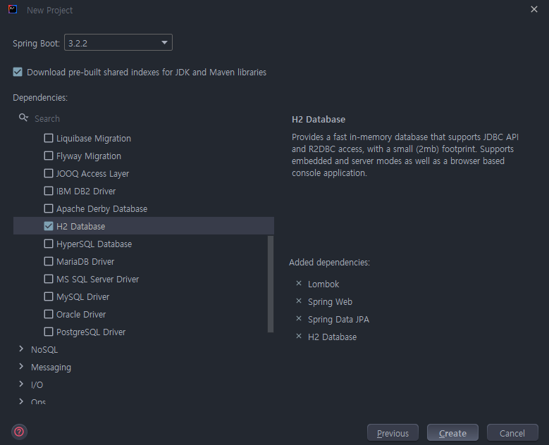

# 프로젝트 세팅
스프링 기반의 테스트 코드 작성을 위한 프로젝트 세팅 방법

## Spring Initializer 활용
### 스프링 버전
강의에선 스프링 2.X 버전을 사용하지만, 현재는 3.X 버전을 많이 사용하기도하고 무엇보다 현재 사이드 프로젝트를 3.2 버전으로 진행하기 때문에 `3.2.2` 버전으로 한다.
### 자바 버전
스프링 3.X 버전을 사용하기 때문에 이에 맞춰 `Java 17` 버전을 사용한다.
### 의존성 추가
* Lombok
* Spring Web
* Spring Data JPA
* H2 Database

### Gradle 의존성 정리
프로젝트 규모가 커질 수록 의존성 관리가 복잡해진다.</br>
`주석을 통해 의존성 용도 구분`을 나눠 관리에 용이하도록 만들자.
```groovy
dependencies {
    // Spring boot
    implementation 'org.springframework.boot:spring-boot-starter-data-jpa'
    implementation 'org.springframework.boot:spring-boot-starter-web'
    
    // test
    testImplementation 'org.springframework.boot:spring-boot-starter-test'
    
    // lombok
    compileOnly 'org.projectlombok:lombok'
    annotationProcessor 'org.projectlombok:lombok'
    
    // h2
    runtimeOnly 'com.h2database:h2'
}
```
