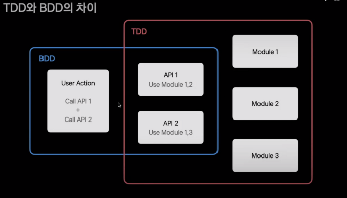

# 1. 테스트는 문서이다.📑
강의에서 설명하는 내용엔 다음과 같이 적혀있다.
* 프로덕션 기능을 설명하는 테스트 코드 문서
* 다양한 테스트 케이스를 통해 프로덕션 코드를 이해하는 시각과 관점을 보완
* 어느 한 사람이 과거에 경험했던 고민의 결과물을 팀 차원으로 승격시켜, 모두의 자산으로 공유

위 내용를 종합하자면, 잘 짜여진 테스트 코드는 프로덕션 코드의 도메인에 대한 청사진(?)으로 볼 수 있을 것 같다.  

이전에 "잘 작성된 테스트 코드는 인수인계 문서로 사용할 수 있다."라는 말을 어디선가 들은 것 같다.

## 1.1 테스트명을 섬세하게 작성한다. 👁‍🗨
위에서 말했듯이 테스트는 팀원들이 함께 보는 문서이다. 때문에 테스트를 봤을 때 `무엇을 테스트 하는지를 쉽게 알 수 있어야 한다.` 
가장 쉬운 방법 중 하나는 테스트를 한글로 작성하는 것 이다. 
### 1.1.1 @DisplayName 어노테이션 활용
@DisplayName 어노테이션은 Junit5에서 만들어진 것으로 영어로 작성된 테스트 메서드(한글로도 작성할 수 있지만, Under Bar를 사용해야한다) 대신 한글로 테스트 이름을 표시할 수 있다. 
내가 아닌 팀을 위해 `적극 사용`

### 1.1.2 좀 더 섬세하게

* `도메인 용어 사용`을 통해 두루뭉실한 표현보단 명확하게 표현하자.
  * 특정 시간 ❌
  * 영업 시간 ⭕
* 테스트 결과가 아닌 테스트 하는 `작업에 대한 응답`으로 표현하자.
  * 테스트를 실패한다 ❌
  * 주문을 생성할 수 없다 ⭕

## 1.2 BDD
BDD란, Behavior Driven Development으로 사용자의 행위를 중심으로 테스트하는 방법론이다.

### 1.2.1 given / when / then
강의에서는 BDD에 대해서 자세하게 언급하진 않지만, BDD 테스트 기법 중 하나인 `given / when / then`을 보여줬다. 
사실 `주어진 환경`, `특정 상황`, `결과` 이 3가지를 통해 행위 중심 테스트를 수행하는 것은 좋은 방식이라 생각한다. 

### 1.2.1 API 테스트(given / when / then) = 행위 중심 테스트 ❓ 
우리는 보통 BDD 테스트를 한답시고 given, when, then 을 테스트 코드에 주구장창 사용한다. 
하지만, 하나의 API 테스트에서 이런식으로 나눠서 진행한다고 정말 행위 중심 테스트일까? 
물론 사용자의 행위가 하나의 API 호출로 끝날 수 있지만, 복잡한 서비스일수록 엵혀있는 관계가 많을 것 이다. 
**즉, 내가 말하고 싶은 것은 BDD는 given/when/then 만 쓴다고 되는게 아니라 정말 통합 테스트가 되어야 한다는 것이다.**
